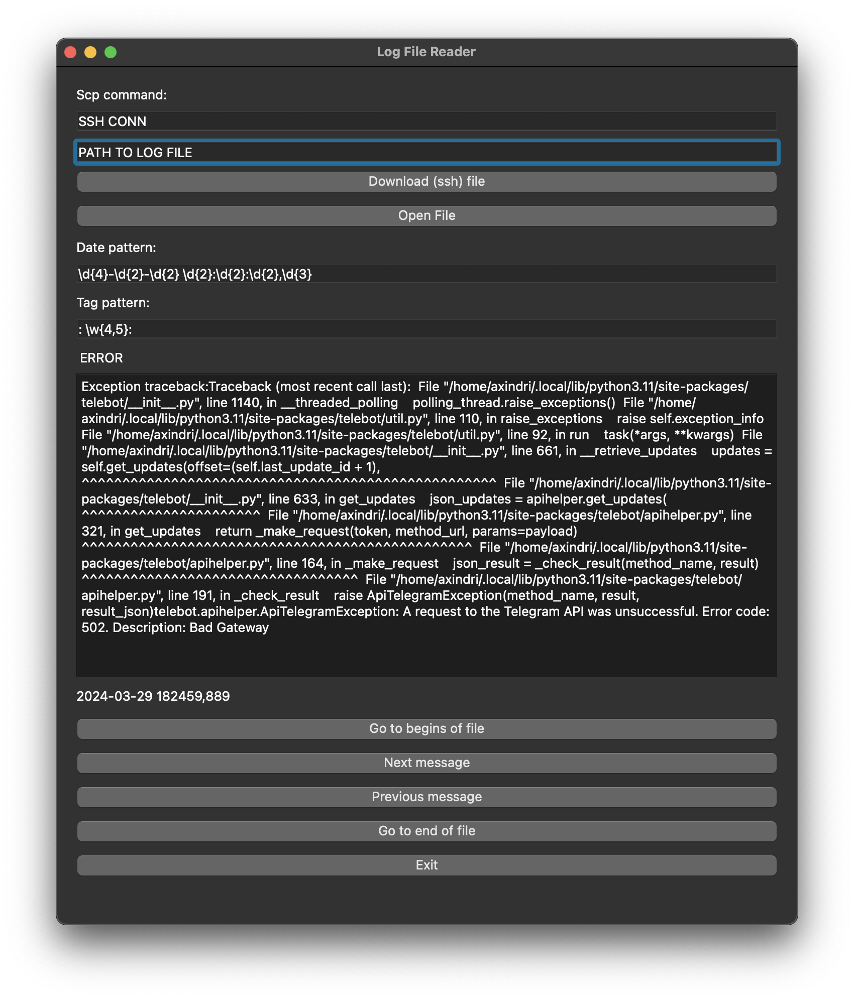

(works on UNIX)
## quick start
1. make venv environment
2. install pyqt5
``` bash
    pip install pyqt5
```
- to build app
``` bash
    pyinstaller --onefile -w main.py
```
### requirements
- pyqt5
  
## pics
Program:


Read log format:
