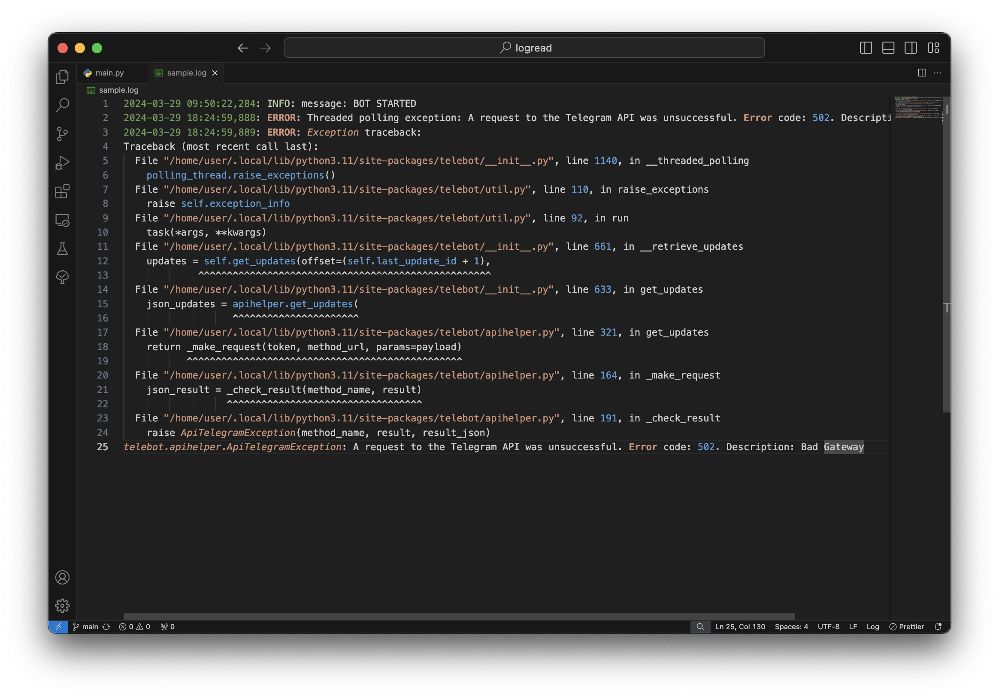
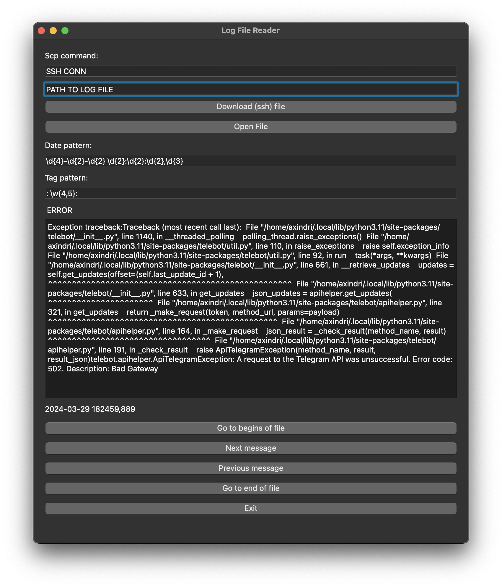

# Log reader (logread)
## About
- works on UNIX
- opensource
- regexp pattern *(in dev)* to read log marks *(date, tag)*

## Quick start
1. make venv environment
2. install pyqt5
``` bash
    pip install pyqt5
```
- to build app
``` bash
    pyinstaller --onefile -w main.py
```
### Requirements
- pyqt5
  
## Pics
Read log format:


Program:
